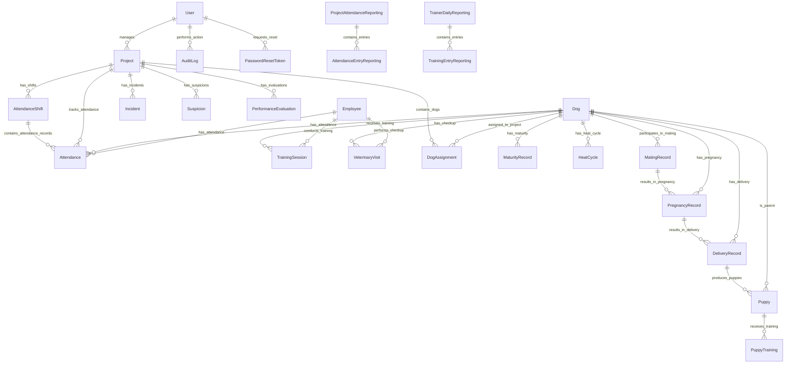

# K9 Operations Management System - Database Entity Relationship Diagram

## Database Schema Overview

The K9 Operations Management System uses a PostgreSQL database with a comprehensive schema designed to manage all aspects of K9 operations, from dog management to project operations and attendance tracking.

## Entity Relationship Diagram

### Core Entities and Relationships



### Detailed Entity Descriptions

## Core Entities

### User Management

#### User
- **Purpose**: System users (administrators and project managers)
- **Key Fields**: 
  - `id` (UUID, Primary Key)
  - `username` (Unique)
  - `email` (Unique)
  - `password_hash`
  - `role` (GENERAL_ADMIN, PROJECT_MANAGER)
  - `active` (Boolean)
  - `mfa_enabled` (Boolean)
  - `allowed_sections` (JSON)

#### Employee
- **Purpose**: K9 unit personnel (handlers, trainers, veterinarians)
- **Key Fields**:
  - `id` (UUID, Primary Key)
  - `name`
  - `role` (Handler, Trainer, Breeder, Vet, Project Manager)
  - `phone`, `email`
  - `hire_date`
  - `active` (Boolean)

### K9 Management

#### Dog
- **Purpose**: Individual dogs in the K9 unit
- **Key Fields**:
  - `id` (UUID, Primary Key)
  - `name`
  - `microchip_id` (Unique)
  - `breed`
  - `gender` (MALE, FEMALE)
  - `birth_date`
  - `status` (ACTIVE, RETIRED, DECEASED, TRAINING)
  - `color`, `weight`, `height`
  - `photo_url`

#### DogAssignment
- **Purpose**: Links dogs to projects
- **Key Fields**:
  - `id` (UUID, Primary Key)
  - `dog_id` (Foreign Key → Dog)
  - `project_id` (Foreign Key → Project)
  - `assignment_date`
  - `end_date`
  - `role` (Detection, Patrol, Guard, etc.)

### Training System

#### TrainingSession
- **Purpose**: Individual training records
- **Key Fields**:
  - `id` (UUID, Primary Key)
  - `dog_id` (Foreign Key → Dog)
  - `trainer_id` (Foreign Key → Employee)
  - `category` (Obedience, Detection, Agility, Attack, Fitness)
  - `date`
  - `duration_minutes`
  - `performance_rating` (EXCELLENT, GOOD, WEAK)
  - `notes`

### Veterinary Care

#### VeterinaryVisit
- **Purpose**: Health checkups and medical treatments
- **Key Fields**:
  - `id` (UUID, Primary Key)
  - `dog_id` (Foreign Key → Dog)
  - `vet_id` (Foreign Key → Employee)
  - `visit_type` (ROUTINE, EMERGENCY, VACCINATION)
  - `date`
  - `diagnosis`
  - `treatment`
  - `cost`
  - `next_visit_date`

### Project Operations

#### Project
- **Purpose**: Operational missions and deployments
- **Key Fields**:
  - `id` (UUID, Primary Key)
  - `name`
  - `description`
  - `status` (PLANNED, ACTIVE, COMPLETED, CANCELLED)
  - `start_date`
  - `end_date`
  - `location`
  - `manager_id` (Foreign Key → User)

#### Incident
- **Purpose**: Security incidents during operations
- **Key Fields**:
  - `id` (UUID, Primary Key)
  - `project_id` (Foreign Key → Project)
  - `date`
  - `description`
  - `severity` (LOW, MEDIUM, HIGH, CRITICAL)
  - `resolved` (Boolean)

#### Suspicion
- **Purpose**: Suspicious activities or findings
- **Key Fields**:
  - `id` (UUID, Primary Key)
  - `project_id` (Foreign Key → Project)
  - `date`
  - `element_type` (WEAPON, DRUG, EXPLOSIVE, OTHER)
  - `description`
  - `investigated` (Boolean)

### Breeding Program

#### MaturityRecord
- **Purpose**: Track dog maturity status
- **Key Fields**:
  - `id` (UUID, Primary Key)
  - `dog_id` (Foreign Key → Dog)
  - `maturity_date`
  - `status` (JUVENILE, MATURE, RETIRED)
  - `notes`

#### HeatCycle
- **Purpose**: Female dog heat cycle tracking
- **Key Fields**:
  - `id` (UUID, Primary Key)
  - `dog_id` (Foreign Key → Dog)
  - `start_date`
  - `end_date`
  - `status` (NOT_IN_HEAT, IN_HEAT, POST_HEAT, etc.)

#### MatingRecord
- **Purpose**: Breeding records
- **Key Fields**:
  - `id` (UUID, Primary Key)
  - `male_dog_id` (Foreign Key → Dog)
  - `female_dog_id` (Foreign Key → Dog)
  - `mating_date`
  - `result` (SUCCESSFUL, FAILED, UNKNOWN)
  - `cycle_type` (NATURAL, ARTIFICIAL)

#### PregnancyRecord
- **Purpose**: Pregnancy monitoring
- **Key Fields**:
  - `id` (UUID, Primary Key)
  - `mating_record_id` (Foreign Key → MatingRecord)
  - `confirmation_date`
  - `expected_delivery_date`
  - `status` (NOT_PREGNANT, PREGNANT, DELIVERED)

#### DeliveryRecord
- **Purpose**: Birth/delivery records
- **Key Fields**:
  - `id` (UUID, Primary Key)
  - `pregnancy_record_id` (Foreign Key → PregnancyRecord)
  - `delivery_date`
  - `total_puppies`
  - `live_puppies`
  - `status` (EXPECTED, IN_PROGRESS, COMPLETED, COMPLICATIONS)

#### Puppy
- **Purpose**: Offspring management
- **Key Fields**:
  - `id` (UUID, Primary Key)
  - `delivery_record_id` (Foreign Key → DeliveryRecord)
  - `name`
  - `gender`
  - `weight_at_birth`
  - `current_status` (ALIVE, DECEASED, ADOPTED)

### Attendance System

#### AttendanceShift
- **Purpose**: Work shift definitions
- **Key Fields**:
  - `id` (UUID, Primary Key)
  - `project_id` (Foreign Key → Project)
  - `name`
  - `start_time`
  - `end_time`
  - `active` (Boolean)

#### Attendance
- **Purpose**: Daily attendance records
- **Key Fields**:
  - `id` (UUID, Primary Key)
  - `entity_type` (EMPLOYEE, DOG)
  - `entity_id` (UUID - references Employee or Dog)
  - `project_id` (Foreign Key → Project)
  - `shift_id` (Foreign Key → AttendanceShift)
  - `date`
  - `status` (PRESENT, ABSENT, LATE, SICK, LEAVE, etc.)
  - `absence_reason`
  - `notes`

### Reporting System

#### ProjectAttendanceReporting
- **Purpose**: Attendance report metadata
- **Key Fields**:
  - `id` (UUID, Primary Key)
  - `project_id` (Foreign Key → Project)
  - `report_date`
  - `group_1_name`, `group_2_name`
  - `generated_by` (Foreign Key → User)

#### AttendanceEntryReporting
- **Purpose**: Individual attendance entries in reports
- **Key Fields**:
  - `id` (UUID, Primary Key)
  - `report_id` (Foreign Key → ProjectAttendanceReporting)
  - `employee_name`
  - `group_assignment` (GROUP_1, GROUP_2)
  - `status` (Present, Absent, etc.)

### Audit and Security

#### AuditLog
- **Purpose**: Complete audit trail of all system actions
- **Key Fields**:
  - `id` (UUID, Primary Key)
  - `user_id` (Foreign Key → User)
  - `action` (CREATE, EDIT, DELETE, LOGIN, etc.)
  - `target_type` (Table/entity name)
  - `target_id` (UUID of affected record)
  - `description`
  - `old_values` (JSON)
  - `new_values` (JSON)
  - `ip_address`
  - `user_agent`
  - `created_at`

#### PasswordResetToken
- **Purpose**: Secure password reset functionality
- **Key Fields**:
  - `id` (UUID, Primary Key)
  - `user_id` (Foreign Key → User)
  - `token_hash`
  - `expires_at`
  - `used` (Boolean)

## Database Design Principles

### 1. Security and Compliance
- **UUID Primary Keys**: Prevents enumeration attacks
- **Audit Logging**: Complete action history for compliance
- **Soft Deletes**: Historical data preservation
- **Role-Based Access**: Granular permission control

### 2. Data Integrity
- **Foreign Key Constraints**: Referential integrity
- **Check Constraints**: Data validation at database level
- **Unique Constraints**: Prevent duplicate data
- **Not Null Constraints**: Required field enforcement

### 3. Performance Optimization
- **Indexes**: Strategic indexing for common queries
- **Partitioning**: Large table optimization (attendance, audit logs)
- **JSON Fields**: Flexible metadata storage
- **Connection Pooling**: Efficient database connections

### 4. Scalability
- **Modular Design**: Clear entity separation
- **Normalized Schema**: Reduces data redundancy
- **Flexible Relationships**: Supports business rule changes
- **Unicode Support**: Full Arabic language support

## Common Query Patterns

### Active Dogs in Project
```sql
SELECT d.name, da.role, da.assignment_date
FROM dogs d
JOIN dog_assignments da ON d.id = da.dog_id
WHERE da.project_id = ? 
  AND da.end_date IS NULL 
  AND d.status = 'ACTIVE';
```

### Training Statistics
```sql
SELECT d.name, 
       COUNT(ts.id) as total_sessions,
       AVG(ts.duration_minutes) as avg_duration,
       ts.category
FROM dogs d
JOIN training_sessions ts ON d.id = ts.dog_id
WHERE ts.date >= DATE('now', '-30 days')
GROUP BY d.id, ts.category;
```

### Attendance Summary
```sql
SELECT e.name,
       COUNT(CASE WHEN a.status = 'PRESENT' THEN 1 END) as present_days,
       COUNT(CASE WHEN a.status = 'ABSENT' THEN 1 END) as absent_days
FROM employees e
LEFT JOIN attendance a ON e.id = a.entity_id 
WHERE a.entity_type = 'EMPLOYEE'
  AND a.date >= DATE('now', '-30 days')
GROUP BY e.id;
```

## Migration Strategy

### Version Control
- **Alembic Migrations**: Automated schema changes
- **Rollback Support**: Safe deployment practices
- **Environment Sync**: Development/Production parity

### Data Migration
- **Seed Data**: Initial system setup
- **Bulk Operations**: Efficient large data imports
- **Validation**: Data integrity checks

For technical implementation details, see the [Developer Guide](DEVELOPER_GUIDE.md).